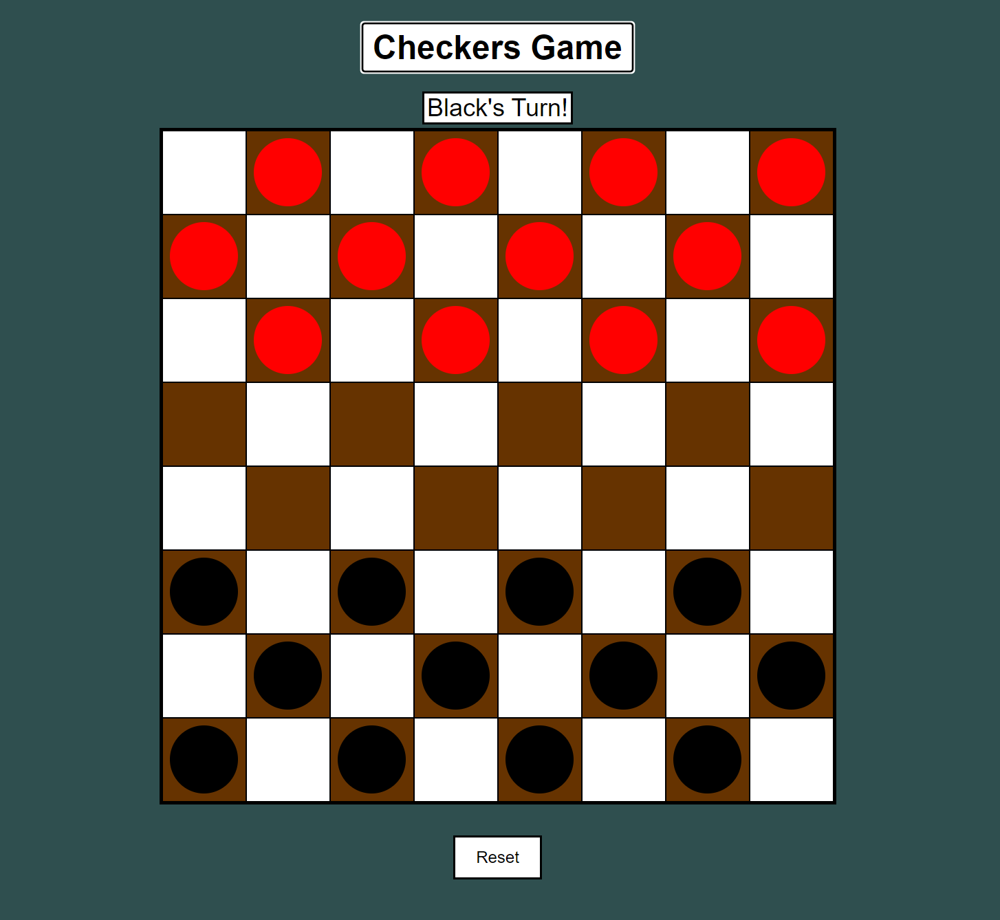

# Checkers

## Preamble
For project 1 of General Assembly, we were asked to make a browser game and got provided a list of recommended games in roughly increasing order of difficulty. Given that I have previous experience and education with software development, I immediatley opted for the last game in the list - checkers. It's helpful that one of my college projects was making a Tile-Matching-Game-Engine, so a lot of the fundamental groundwork was already laid out. However, adapting to JS/HTML proved to still be a worthwhile and informative endeavor.

## Getting Started:

The url for the game can be found [here](https://drewanzalone.github.io/checkers-project/).

### Instructions:
> To play the game, click any piece. If the piece belongs to the current turn's player and has valid moves, it will be selected and show the valid moves. Clicking a valid move will then play that move and end the turn. 
Additionally, if the played move is an attack, and additional attacks are available from that piece, chain attacks are required to be played. 
Official international rules require all valid attacks to be immediately played, but in this version only chain attacks are required.

## Technologies:
- Javascript
- CSS
- HTML

## Next Steps:
1. Lightmode toggle
2. Debug toggle
   - Allow placement and removal of pieces on click instead of having to play out a game.
3. Make CSS robust and dynamic for various screen dimensions
4. Instructions dropdown menu
5. Show captured pieces off to the side of the board
6. More detailed pieces
   - Render images instead of rounded pseudoelement after divs
7. Animate pieces moving
